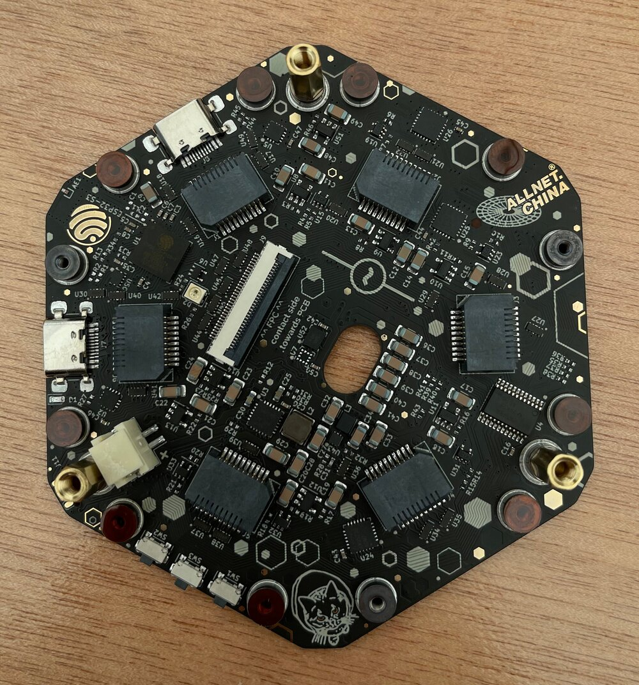
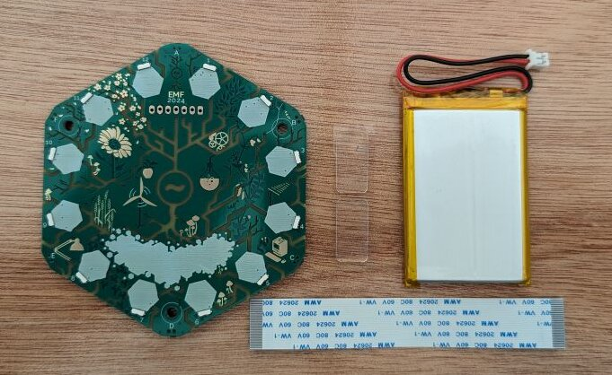
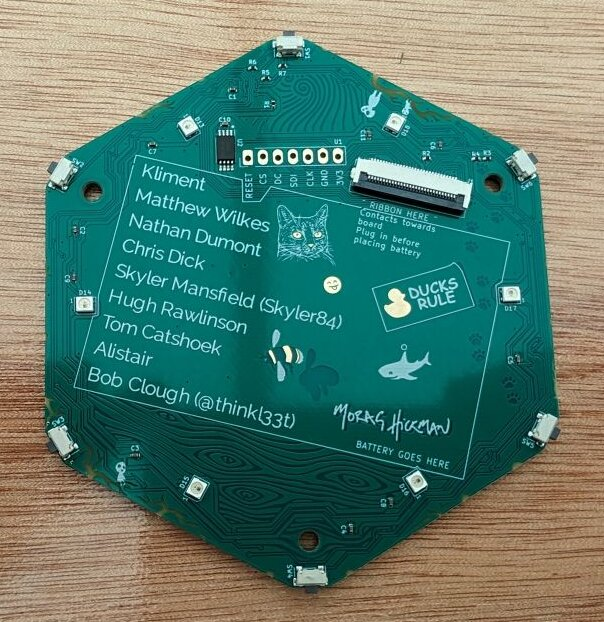
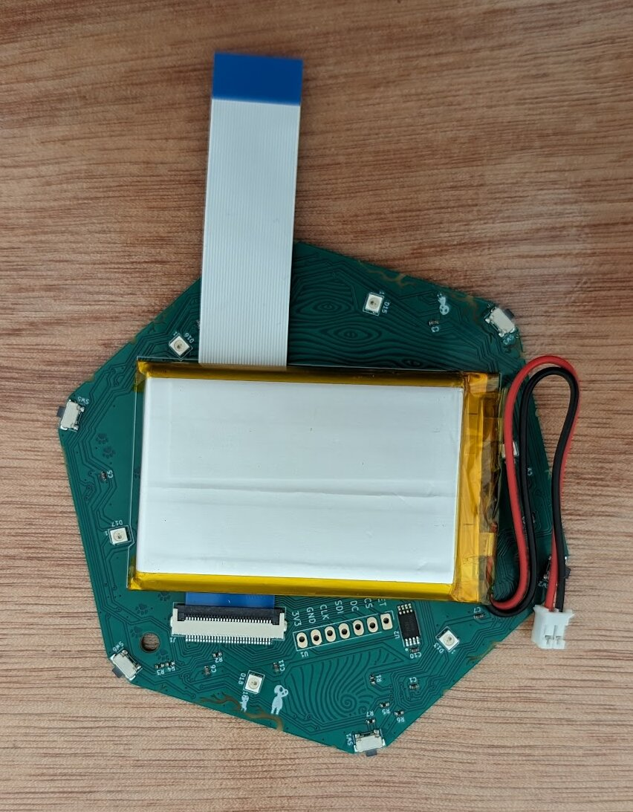
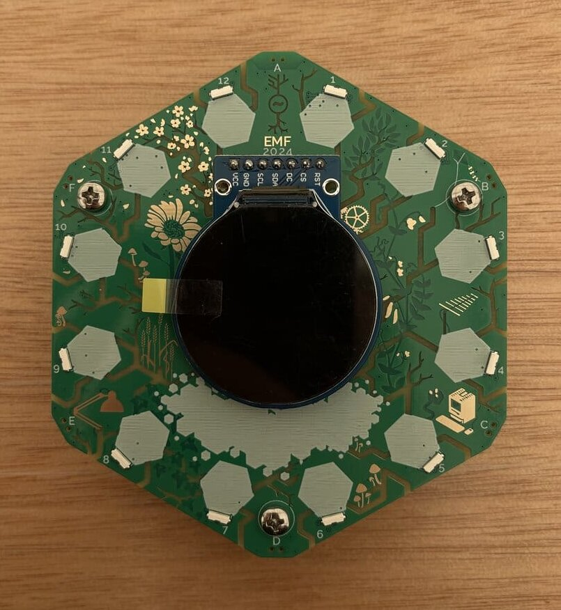

!!! warning "Apps can be published on the [app store](https://apps.badge.emfcamp.org/) but currently do not run on the badge yet. The badge team are currently working on this as fast as they can, please be patient!"

{: style="width:300px; height: auto" , align=right }

The Tildagon is a badge that you can wear around your neck. It has a round screen, six buttons, and lots of colourful LEDs. It has a USB-C connector, WiFi, and a battery. It can run MicroPython, and has six hexpansion connectors.

The badge will automatically connect to camp wifi, and you can use the [app store](https://apps.badge.emfcamp.org/) to install apps.

The hexpansions that the badge supports allow you to extend the functionality of the badge with hardware made by other attendees.

## Assembly

The following components come with each badge kit:

{: style="width:500px;height: auto;margin:auto;display:block;" }

From top to bottom, left to right:

- Tildagon information with link to docs
- battery
- badge front
- badge base
- display
- 3 screws, 2 glue stickers
- display cable
- Tildagon sticker

### 1. Attach the standoffs to the base of the badge

Get the three golden standoffs. Remove the plastic protector stickers on top of the middle screw mounts wherever you see three mounts together:

  
  
  

{: style="width:300px;height: auto;margin:auto;display:block;" }

### 2. Assemble the front of the badge

Start with the badge front, display cable, and glue bits:

{: style="width:400px;height: auto;margin:auto;display:block;" }

Flip the badge front, so you can see the names of the badge team:

{: style="width:300px;height: auto;margin:auto;display:block;" }

Attach the camera ribbon to connector. Lift the black bit and slide the ribbon cable into the connector. The contacts should be placed towards the board. The blue side of the ribbon should remain visible.

  
  

Next, attach the glue stickers to the badge front inside the rectangle.

{: style="width:300px;height: auto;margin:auto;display:block;" }

Peel the protectors from the glue stickers to attach the battery. Then, get the battery and place it **over** the ribbon cable inside the rectangle ensuring the battery goes completely inside the rectangle.

{: style="width:500px;height: auto;margin:auto;display:block;" }

### 3. Attach the display

Attach the other end of the ribbon camera to the back board. Then gently push the display into the pins on the front of the badge.

!!! note "Display not working?"

    If your display is broken, you can acquire a new one on [Aliexpress](https://www.aliexpress.com/item/1005005936868343.html) or [Amazon](https://www.amazon.co.uk/ARCELI-Arduino-Resolution-Interface-Display/dp/B0CFXVD9HX/).

### 4. Flash your badge

Follow the directions in [Flash your badge](#flash-your-badge) before you continue assembly.

### 5. Attach the battery to the back of the badge

On the back of the battery, remove the plastic lid from the battery connector:

  
  

Then attach the battery cable to battery connector on the back board.

  
  

### 6. Screw the badge front to the badge back

Use the 3 screws to screw the badge front to the badge base. The top of the base board is between the two USB-C ports and should be aligned with the top of the front board which is where the **A** button is.

  
  

{: style="width:500px;height: auto;margin:auto;display:block;" }

That's it!

## Flash your badge

** Note, you don't need to do this step if you received your badge after 1pm Friday 31st May, badges come pre-flashed! **

To flash your badge, it is best if the battery is not yet connected. It may not work with the battery connected.

1. Open the [web flasher](https://emfcamp.github.io/badge-2024-software/) in a Chromium-based browser.

    !!! info "The flasher may not work in other browsers."

1. Hold the middle button, designated **boop** (the designation is on the back of the badge), while you connect the badge **USB in** port to your computer. This will load the bootloader.
1. Keep holding the **boop** button until you click on the **Connect** button on the web flasher and select the Tildagon. You can now let go of the **boop** button.
1. Select the **Install Tildagon** option.
1. When prompted to confirm the installation, click *Install*. Installation may take a few minutes.

When you see the **Installation complete** notification, your badge is flashed. To test your badge, press and hold the **reboop** button which will perform a soft reboot. When you are done testing, [power off your badge](#power-off) and disconnect it from your computer.

!!! info "Don't want to use chromium?"

    You can also manually flash the badge following the instructions in the [`badge-2024-software` Readme](https://github.com/emfcamp/badge-2024-software).

## Operate your badge

### Power on

To power on your badge, press and hold the bottom button designated _bat_ (the designation is on the back of the badge) for 2 seconds.

### Navigate the menu

Use the buttons **A** (`UP`) and **D** (`DOWN`) to move up and down in the menu. To select a menu item, press **C** (`CONFIRM`). To go back to a previous menu or exit an app, press **F** (`CANCEL`).

!!! info "Note that badge apps may use buttons differently."

### Power off

To power off the badge, select the menu item **Power off**.

## Buttons

### Front of the badge

- **A** (`UP`): In the menu, this button navigates up. In apps the functionality may vary.
- **B** (`RIGHT`): When entering text in a dialogue, this button allows you to add another letter. In apps the functionality may vary.
- **C** (`CONFIRM`): This generally confirm the selection. In a dialogue, this button means yes. In apps the functionality may vary.
- **D** (`DOWN`): In the menu, this button navigates down. In apps the functionality may vary.
- **E** (`LEFT`): When entering text in a dialogue, this button allows you to move leftadd another letter. In apps the functionality may vary.
- **F** (`CANCEL`): This generally cancels the selection. In a dialogue, this button means no. In apps the functionality may vary.

### Back of the board

- **reboop**: Press and hold the **reboop** button to perform a soft (re)boot.
- **boop**: Press and hold the **boop** button while connecting to power to load the bootloader.
- **bat**: Press the **bat** button to power on your badge.
